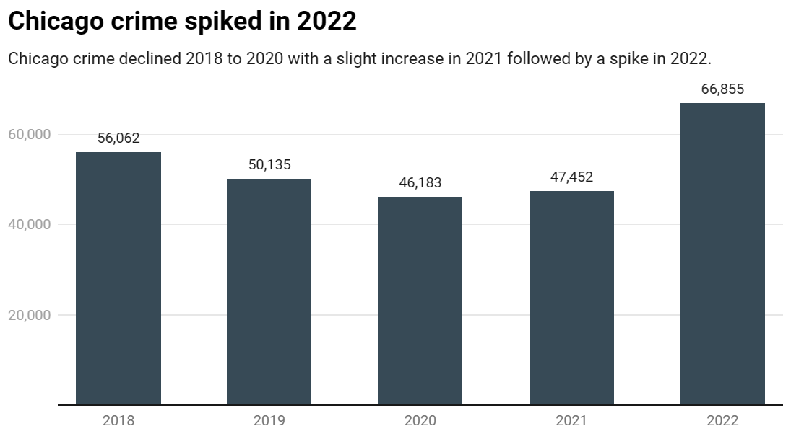
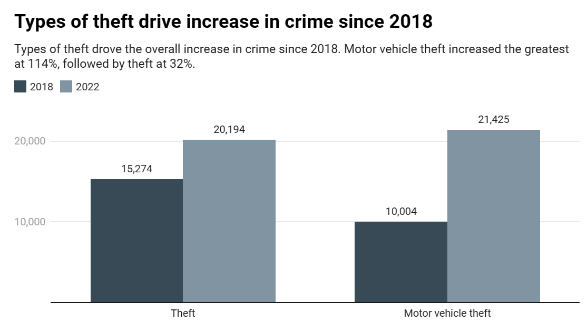
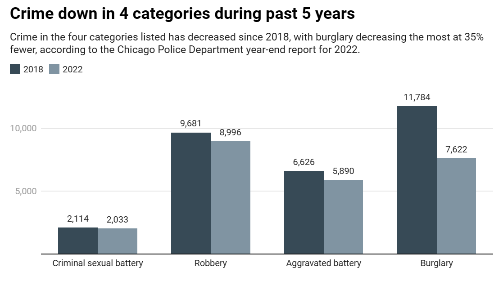
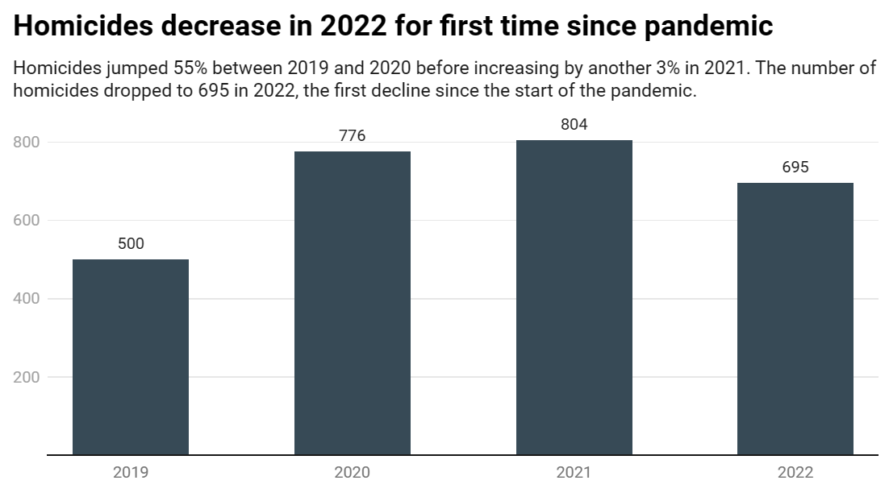
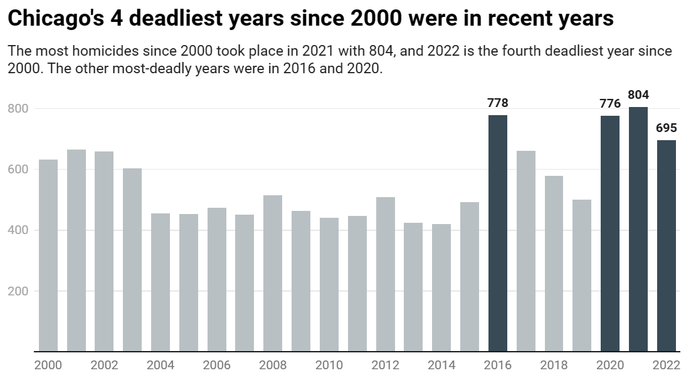

# CHICAGO CRIME SPIKES IN 2022, BUT FIRST DROP IN MURDER SINCE PANDEMIC

Crime in Chicago overall has increased during the past five years by nearly 20%, according to an official report by the Chicago Police Department. The year-over-year change in crime was even greater last year. Between 2021 and 2022, overall crime in Chicago increased by 41%, after overall crime had decreased each year in 2019 and 2020 and slightly increased in 2021.

Theft is driving the overall increase in crime. Car theft is up 114% since 2018, and other thefts increased by 32% since 2018. Just last year, motor vehicle theft increased by 102% and theft by 56%.

Meanwhile, instances of criminal sexual assault, robbery, aggravated battery and burglary have all decreased during the five-year period. Burglary had the biggest decline with 35% fewer instances in 2022 than in 2018.

Despite a five-year decline in robbery and burglary, the year-over-year change showed each increased last year by 14%. Criminal sexual assault and aggravated battery still recorded declines in the past year. Murders also declined last year by 14%, despite an overall increase of 20% during the five-year period.

Chicago in 2022 recorded the fewest homicides since before the pandemic. In the first year of the pandemic – between 2019 and 2020 – homicides in Chicago increased by 55%. Homicides increased again in 2021 to 804, which marked one of the deadliest years Chicago has experienced in the past quarter-century.

Despite the decrease in homicides last year, there were only three other years since 2000 in which Chicago had more homicides than it did in 2022 – and all three of those years took place recently, in 2016, 2020 and 2021.

