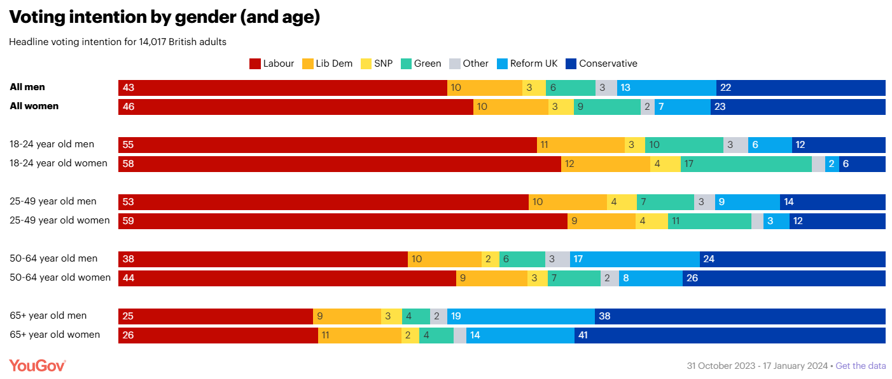

# How is Britain voting as we enter the 2024 election year?

## The coalition that won the Conservatives the 2019 general election has crumbled

With Rishi Sunak suggesting that the next general election will fall in the second half of this year, a new YouGov mega-poll – combining voting intention polling from 31 October – 17 January, totalling more than 14,000 respondents – takes stock of the electoral landscape. Below we look in detail at the demographic make up of current voting intention.

## Age

Age will continue to be the key dividing line at the general election.

The Tories are now the most popular party only among the over-70s, 43% of whom back the party. This is down from 67% in 2019, however, with Labour being the main beneficiaries, having increased their vote share among the oldest Britons from 14% to 23%.

Britons in their 60s are split, with 33% backing Labour and 31% the Conservatives. The majority of Britons under-50 now say they will vote Labour.

Reform UK finds more support among older age groups, gathering 17% of the vote among Britons over-60. The Brexit Party vote share was very low at the 2019 general election, as the party stood down candidates in more than 300 seats after Boris Johnson committed to leaving the EU by 2020, but these figures are similar to the party’s position in October 2019, two months before that year’s election.

Support for the Greens is higher among younger people, reaching 14% among 18-24 year olds and 12% among 25-29 year olds. This is significantly above their 2019 general election tally, although as with Reform UK the figures are very close to our pre-election polling in October 2019, suggesting a similar direction of travel to last time is possible.

Liberal Democrat support is largely consistent across age groups, at 9-12%. This represents a slightly lower haul than 2019.

## Gender

Labour have a slightly higher vote share among women (46%) than men (43%), as they did in 2019. For the Tories the split is about the same – 22% of men and 23% of women.

Within the age groups are some more pronounced voting differences. Women in the 25-49 and 50-64 year old age groups are six points more likely to vote Labour than men are. Young women – those aged 18-24 – are noticeably more likely to favour the Greens than men the same age (17% vs 10%).

While right wing parties are more unpopular among younger voters, they do have greater support among men than women. Among 18-24 year old men, while 12% intend to vote Conservative and 6% Reform UK, among women the same age these figures are 6% and 2% respectively.

## Education

Education likewise remains a key factor in voting intention, with people more likely to vote for Labour or a left wing party the more education they have.

Unlike last time, however, Labour are favoured over the Conservatives at every education level. Among graduates – with whom they traditionally have an advantage – Labour beat the Tories by 53% to 14%, while among those whose with the lowest level of education (their top qualification is a GCSE or have no qualifications at all), they lead by 36% to 32%.

While the graduate population of the UK is increasingly trending younger with the expansion of higher education, the preference for Labour among those with higher levels of education is not explained solely by their youth.

Among younger Britons (18-34 year olds), educational status makes little difference to the Labour vote share – at our three education levels between 57-59% say they will back the party. Among older age groups, however, there is notably higher support for Labour among graduates. Indeed, graduates over the age of 50 are backing Labour over the Conservatives by 44% to 20%. Among the least educated group of over-50s, the Tories still lead by 39% to 28%.

Across all age groups, the lower a person’s level of education, the more likely they are to vote for one of the two right wing parties – although this trend is less pronounced among the youngest age group as relatively few would back a right wing party.

## Class

While economic class was once the primary prism through which voting behaviour in Britain could be explained, this has not been the case for the last few elections – and remains so.

Breaking down voting behaviour into the NRS social grades, AB, C1, C2 and DE, shows little to no voting trend for either Labour or the Conservatives. Among each group the Conservative vote share stands at 21-26%, while Labour score 42-48%.

## Past vote

Looking only at those who currently know how they’d vote if there was an election, the Conservatives are only holding on to 55% of their 2019 vote. One in five (21%) are abandoning the party for Reform UK, and a further 15% for Labour.

Meanwhile, Labour are retaining fully 82% of their 2019 vote – their largest leakage currently is 9% of voters to the Greens (although they are in return taking 29% of 2019 Green voters).

Including voting intention from the 2017 general election and EU referendum shows the extent to which the Conservatives 2019 electoral coalition has fractured.

In 2019 the Tories managed to attract 74% of Leave voters; now only 38% would pick the Conservatives. Roughly a quarter apiece are instead turning to Labour (26%) and Reform UK (23%).

In fact, given that they are leaking Leave voters to both the left and right, the Conservatives are now actually holding on to a greater proportion of their 2019+Remain voters (63%) than their 2019+Leave voters (53%).

The Conservatives have also lost the majority of those 2017 Labour voters they managed to coax into voting for the party in 2019. Only 29% of these defectors intend to repeat their vote for the Conservatives at the coming election.

The largest portion have returned to the Labour party under Keir Starmer (44%), while 18% have gone on to Reform UK.

