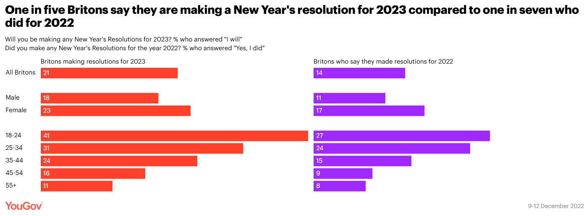
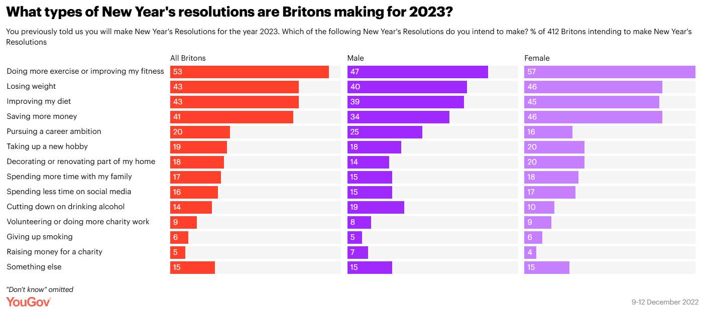
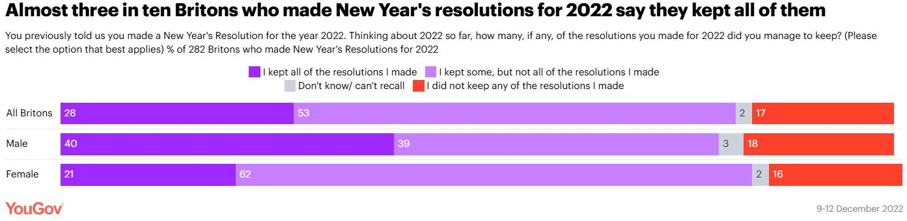

# How many Britons have made New Year’s resolutions for 2023?

## More than half of those who have made a resolution for the new year intend to do more exercise or improve their fitness

As we bid farewell to 2022, many Britons will be taking the opportunity to make some New Year’s resolutions. A new YouGov survey has revealed that one in five Britons (21%) say they will make a New Year’s resolution for 2023, compared to just one in seven (14%) who say they made a resolution for 2022.

The younger generation are the most likely to vow to make some changes for the new year, with four in ten 18-24 year olds (41%) saying they’ll make a resolution for 2023 compared to just one in nine of those aged 55 and over (11%).

 
For the fourth consecutive year, doing more exercise or improving their fitness tops the list for more than half of Britons (53%) who intend to make a resolution for 2023. Health dominates the top three plans that Britons have for the new year with 43% saying they plan to lose weight and the same proportion resolving to improve their diet.

Health-based resolutions are more popular among women with 57% of those intending to make resolutions planning to do more exercise or improve their fitness compared to 47% of men. Losing weight is also a more popular resolution for women (46% compared to 40% of men) as well as improving their diet (45% of women compared to 39% of men).

In the biggest change year-on-year in terms of resolutions, four in ten Britons who are making resolutions (41%) say they want to save more money, up from 30% who resolved to put more money into their savings in 2022. This resolution is also more important to women with 46% saying they hope to save money as part of their plans for 2023 compared to 34% of men.

In another increase from last year, 18% of those making resolutions for the new year plan to decorate or renovate part of their home, up eight percentage points from last year. One in five women (20%) plan to spruce up their home in 2023, an increase of 11 percentage points from the previous year

## How many Britons kept their 2022 New Year’s resolutions?

A New Year’s resolution isn’t just for January, however, of those who made resolutions at the end of 2021, only 28% of them say they kept all of them. Just over half (53%) say they managed to keep some but one in six (17%) admit they didn’t keep any of their resolutions.

While a similar percentage of men (11%) and women (17%) made resolutions for 2022, among people who made resolutions, men are nearly twice as likely to claim they kept all of their resolutions than women are (40% vs 21%).

