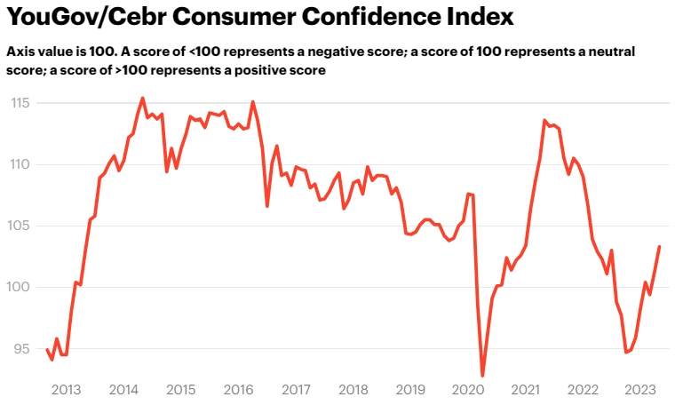
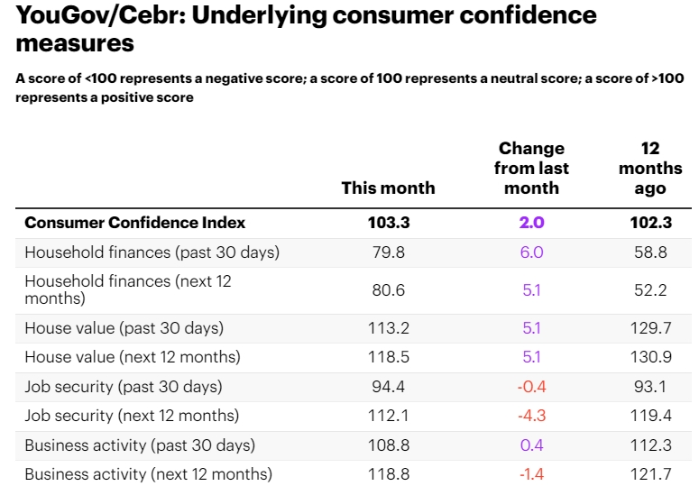

# May 2023: Consumer confidence rises – but outlook for job security and business activity declines

Consumer confidence increased from 101.3 to 103.3 (+2.0) in May 2023, according to the latest data from YouGov and the Centre for Economics and Business Research (Cebr) – but with optimism around job security and business activity diminishing over this period, it’s not all good news.

YouGov collects consumer confidence data every day, conducting over 6,000 interviews a month. Respondents answer questions about household finances, property prices, job security, and business activity, reflecting on these matters over the past 30 days and looking ahead to their prospects over next 12 months.

The rise in overall confidence can be largely attributed to improvements in household finance measures and house price measures. For personal finances, metrics for the past 30 days jumped from 73.8 to 79.8 (+6.0), while outlook increased from 75.5 to 80.6 (+5.1). This marks seven months of improvement for the former measure and nine months of improvement for the latter – but overall sentiment is still negative for both.

As for homeowners, retrospective house price measures went from 108.1 to 113.2 in May, while measures for the next 12 months went from 113.4 to 118.5 – an improvement of 5.1 points for both. Given the news reported this month that house prices had fallen for the first time in 11 years, this bounce may not last too long.

Amid the good news, job security metrics declined. Measures for the past 30 days fell from 94.8 to 94.4 (-0.4), while outlook deteriorated from 116.4 to 112.1 (-4.3). And while employees perceived a slight uptick in business activity over the past 30 days, which rose from 108.4 to 108.8 (+0.4), outlook declined from 120.2 to 118.8 (-1.4).

