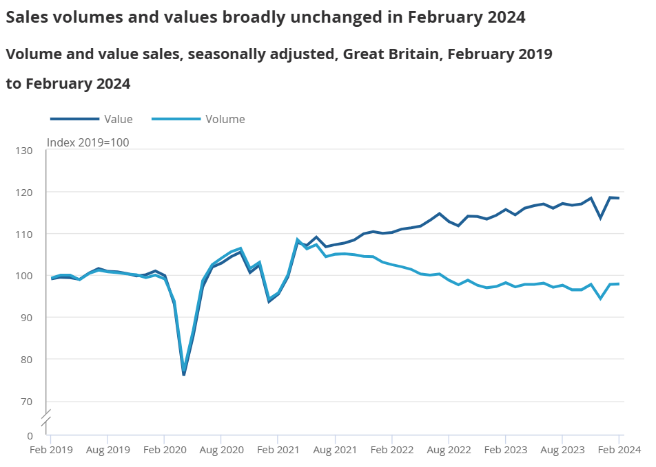

# Retail sales, Great Britain: February 2024

Retail sales remain unchanged from January 2024, according to a first estimate.

## Retail sales in February

February 2024 was a steadier month as sales values (amount spent) fell marginally by 0.1%, alongside unchanged volumes.

However, volumes fell 0.4% over the year and remained 1.3% below their pre-coronavirus (COVID-19) pandemic level in February 2020. These data are available in our Retail Sales Index datasets.

## Retail sectors

Non-food stores sales volumes (the total of department, clothing, household and other non-food stores) rose by 0.7% over the month to February 2024, but fell 0.5% over the year.

Most of the increase within non-food stores was because of a monthly rise of 1.7% within clothing stores, following recent monthly falls. Retailers reported that new collections and promotions contributed to this rise.

Sales volumes at department stores and other non-food stores also grew over the month (by 1.6% and 0.4%, respectively). However, household goods stores fell by 1.0% with respondents reporting the economic climate and poor weather as factors that contributed to the fall.

The Met Office climate summaries reported a mild but wet February 2024 with generally unsettled weather. Southern England received 239% of its average rainfall and in this area, it was the wettest February on record (from 1836).

Food stores sales volumes fell by 0.3% over the month following January's recovery from December's record fall in 2023. Respondents again reported poor weather leading to a reduction in footfall, consistent with footfall measures in our Economic activity and social change in the UK, real-time indicators bulletin.

Automotive fuel sales volumes fell by 1.3% over the month to February 2024 as fuel prices increased slightly. For more information on fuel prices, see GOV.UK's Weekly road fuel prices tables.

## Online retail

The amount spent online, known as online spending values, rose by 2.1% over the month to February 2024 (2.2% over the year). This monthly rise was the largest since July 2023 when shoppers switched to online shopping because of poor weather and increased promotions.

Clothing retailers reported strong online sales while department stores and household goods stores were the only two subsectors where sales values fell over the month.

This monthly increase in online sales led to a rise in the proportion of sales made online, from 25.1% in January 2024 to 25.7% in February 2024.