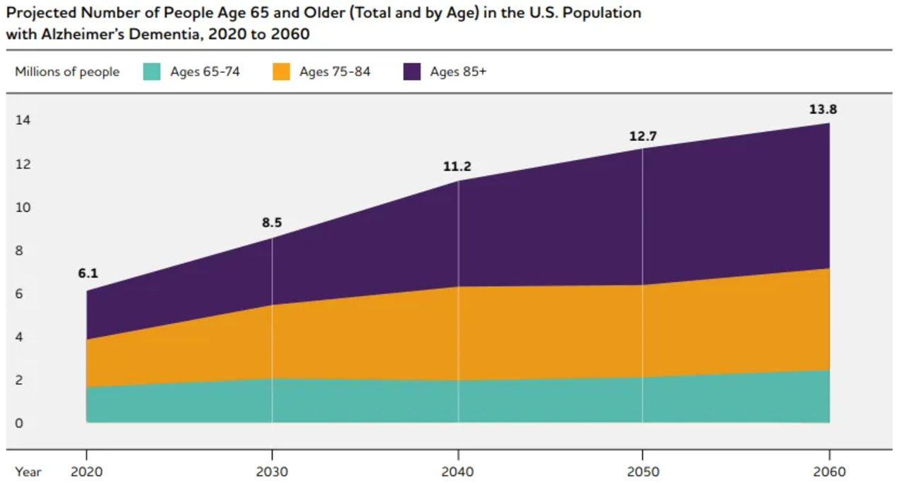
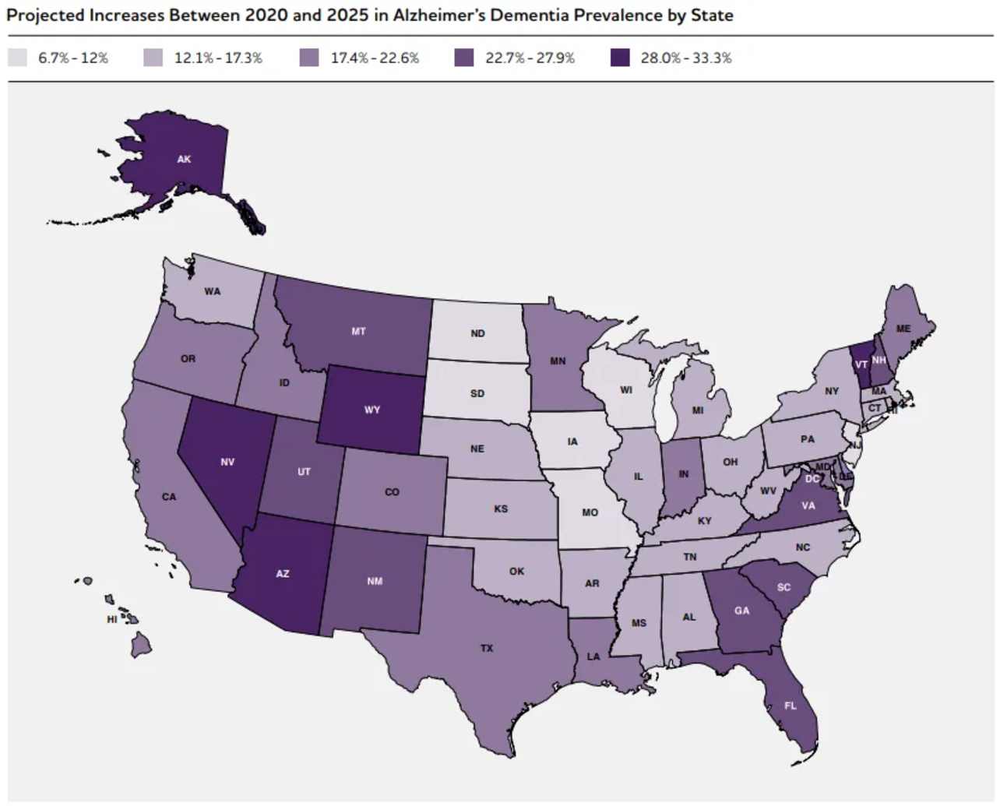
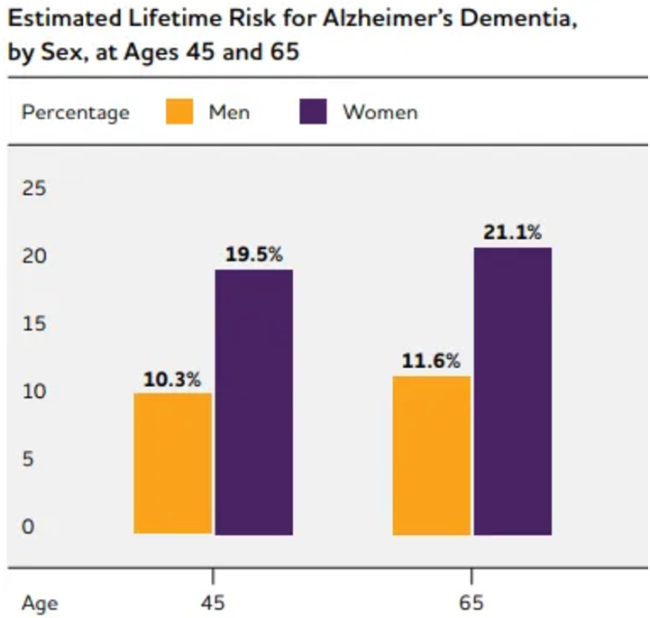
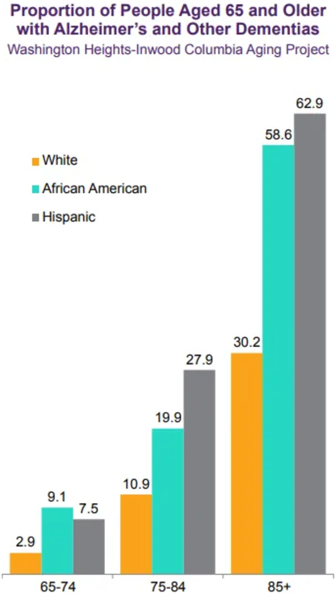

# The Alarming Rise of Alzheimer’s Disease in the U.S

In 2023, Alzheimer’s disease was the fifth leading cause of death in the United States. This places it behind heart disease, cancer, chronic lower respiratory diseases, and stroke in terms of mortality. Despite significant advances in medical research and treatment, Alzheimer’s disease continues to be a major public health concern.

According to the Alzheimer’s Association, in 2022, an estimated 10.7% or 6.5 million Americans aged 65 and over were living with Alzheimer’s. This number is expected to increase to 13.8 million by 2060. The disease not only affects the individual diagnosed but also their loved ones who are often left to navigate the challenges of caregiving and support. It’s important to raise awareness about Alzheimer’s disease and support research efforts to find a cure.

## Prevalence of Alzheimer’s Diseases in the U.S

### By State

Projections indicate that between 2020 and 2025, every U.S. state will see an increase of at least 6.7% in the number of people with Alzheimer’s.
The West and Southeast regions are expected to experience the largest percentage increases in people with Alzheimer’s dementia during this period, based on shifts in the age composition of their populations.
These increases will significantly impact states’ healthcare systems and Medicaid programs, as they cover the costs of long-term care and support for older residents with dementia, including a substantial portion of Medicare beneficiaries with Alzheimer’s.

### By Sex

Lifetime risk data from the Framingham Heart Study indicates that the estimated lifetime risk for Alzheimer’s dementia at age 45 is around 20% for women and 10% for men. These risks increase slightly at age 65.
In the U.S., almost two-thirds of Americans with Alzheimer’s are women. Among the 6.5 million people aged 65 and older with Alzheimer’s, 4 million are women and 2.5 million are men, representing 12% of women and 9% of men in this age group.
This prevalence disparity is partly due to women’s longer life expectancy, as older age is a significant risk factor for Alzheimer’s. This leads to a higher prevalence of Alzheimer’s and other dementias in women compared to men.

However, when it comes to differences in the risk of developing Alzheimer’s between men and women of the same age (incidence), findings vary.
It may be influenced by age and geographic region, and some disparities may result from who is more or less likely to die from other health factors before developing dementia, a phenomenon known as “survival bias”.( a common statistical error that occurs when the data used for analysis is not representative of the entire population because it only includes individuals or entities that have “survived” up to a certain point in time or met specific criteria.)

### By Ethnicity

Older non-Hispanic Black and Hispanic Americans are more likely than older Whites to have Alzheimer’s or other dementias.
Data from the CHAP study reveals that 19% of Black and 14% of Hispanic adults aged 65 and older have Alzheimer’s dementia, compared to 10% of White older adults.
Studies generally show that older Blacks are about twice as likely as older Whites to have Alzheimer’s, while older Hispanic adults are about one and a half times as likely.
There is evidence of missed or delayed diagnoses of Alzheimer’s and other dementias among Black and Hispanic older adults compared to White older adults.

Black and Hispanic people in the U.S. face a higher risk of dementia than white people, but this is not because of their genes. It is because of structural racism, a system that has oppressed and excluded them for generations.
Structural racism affects every aspect of their lives, from where they live, to how they are treated by doctors, to what jobs they can get, to what pollutants they are exposed to.
All these factors can damage their brain health and increase their chances of developing chronic diseases like heart problems and diabetes, which are also linked to dementia. Moreover, growing up and living in segregated environments can harm their cognitive abilities as they age, especially for Black Americans.