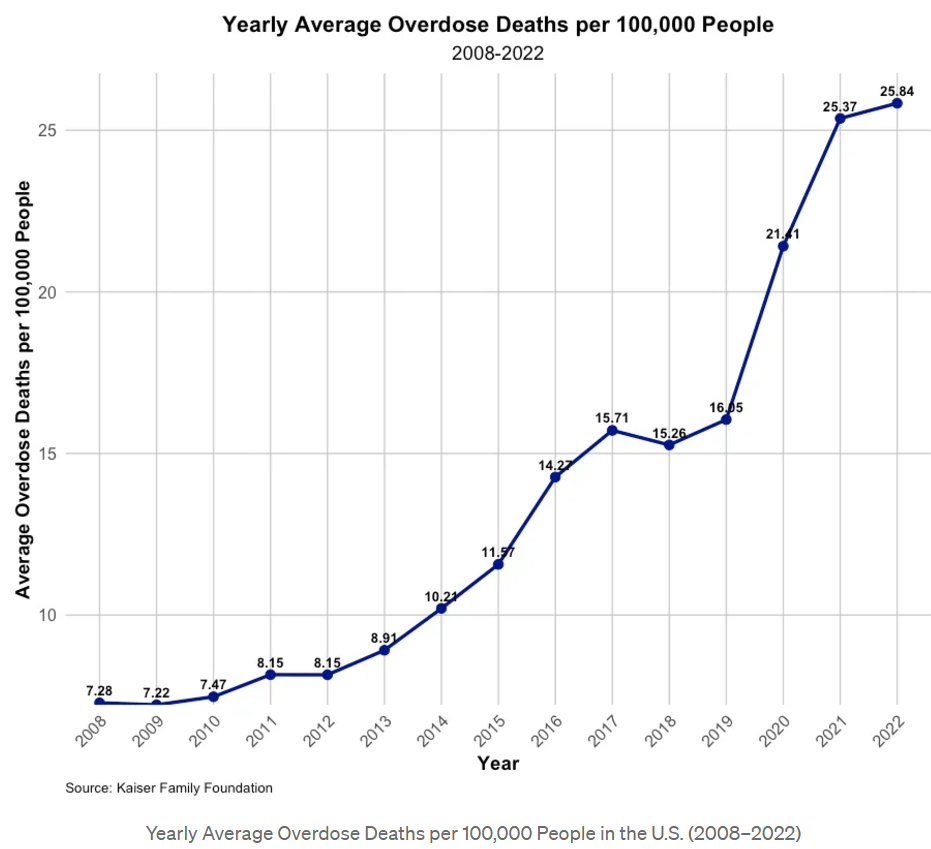

# Visualizing the Unseen The Hidden Toll of the Opioid Crisis

## The Rising Tide: A Decade of Escalating Overdose Deaths

This graph illustrates the alarming rise in average overdose deaths per 100,000 people in the United States from 2008 to 2022. The trend shows a dramatic increase, particularly from 2015 onward, where the average surged from 10.23 to 25.84 deaths per 100,000. The data highlights a critical public health crisis that has only intensified over the years, calling for urgent action and intervention.

## America’s Opioid Epidemic: A Growing Shadow Over the Nation

This series of maps vividly illustrates the spread and intensification of the opioid crisis across the United States from 2008 to 2022. Early in the timeline, overdose deaths are more localized, but by 2017, a darkening wave emerges, particularly in Appalachia and the Northeast.

The maps reveal how what began as a regional crisis has transformed into a nationwide epidemic, with the darker shades in recent years signaling the deepening severity of the problem. This visualization underscores the urgent need for targeted interventions to combat this growing public health emergency.

## Where the Crisis Hits Hardest: State-by-State Breakdown of Overdose Deaths

This bar chart reveals the stark disparities in average overdose death rates across U.S. states from 2008 to 2022. West Virginia, with an alarming 37.33 deaths per 100,000 people, stands out as the epicenter of the crisis, followed by Maryland and the District of Columbia.

The wide variation between states highlights the uneven impact of the opioid epidemic, with some regions facing far more severe challenges. This visualization underscores the need for targeted, state-specific interventions to effectively address the crisis.