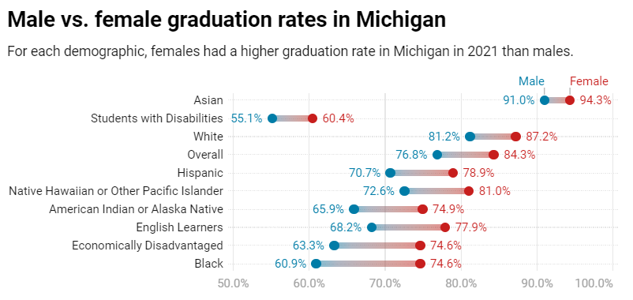

# Males drop out of school at nearly twice the rate of females in Michigan

Females had a higher graduation than males in Michigan in 2021 – and that remains the case for every subgroup measured (race, disability level, income level, etc.).

About 84.3% of women graduated on time last year compared to 76.8% of men, according to data from MiSchoolData.org, which is connected with the Michigan Department of Education.
Conversely, the male dropout rate was 9.5%, while the female dropout rate was 5.7%.

The difference in male and female graduation rates is less pronounced for Asian students and students with disabilities, but wider for Black students and economically disadvantaged students.

Here’s a look at how the graduation rate differed by sex for each subgroup the state measured, going from the smallest gap to the largest.

There are notable differences in graduation rates between the sexes and by race. But other demographics have a larger impact on graduation rates.

Michigan’s overall graduation rate was 80.5%, but it was only 39.5% for students in foster care. Homelessness was the next lowest subgroup, with only 54.3% of homeless students graduating on time. Students with disabilities were next with a 57% graduation rate.

Asian women had the highest graduation rate of any subgroup at 94.3%.

Here’s a breakdown of the statewide average for graduation rate by subgroup.

## Michigan’s overall graduation rate dips in 2021

After four consecutive years of improvements, Michigan’s graduation rate dropped from 82.1% in 2020 to 80.5% in 2021. That’s the largest drop in at least a decade.

Michigan’s graduation rate is still higher than it was anytime between 2007 and 2017 (the state’s online graduation data starts in 2007), as it had been slowly on the rise each year.

The state’s dropout rate decreased in 2021 to 7.7% – about half of what it was in 2007. The graduation and dropout rates don’t add up to 100% because of the group of students who didn’t drop out, but weren’t on track to graduate in four years.

